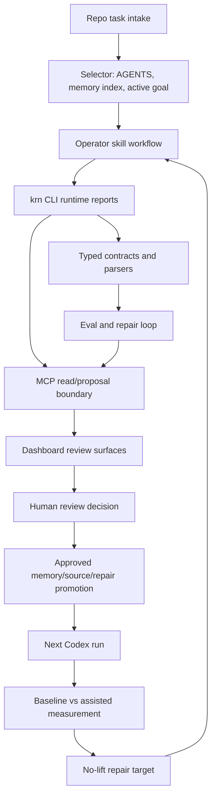
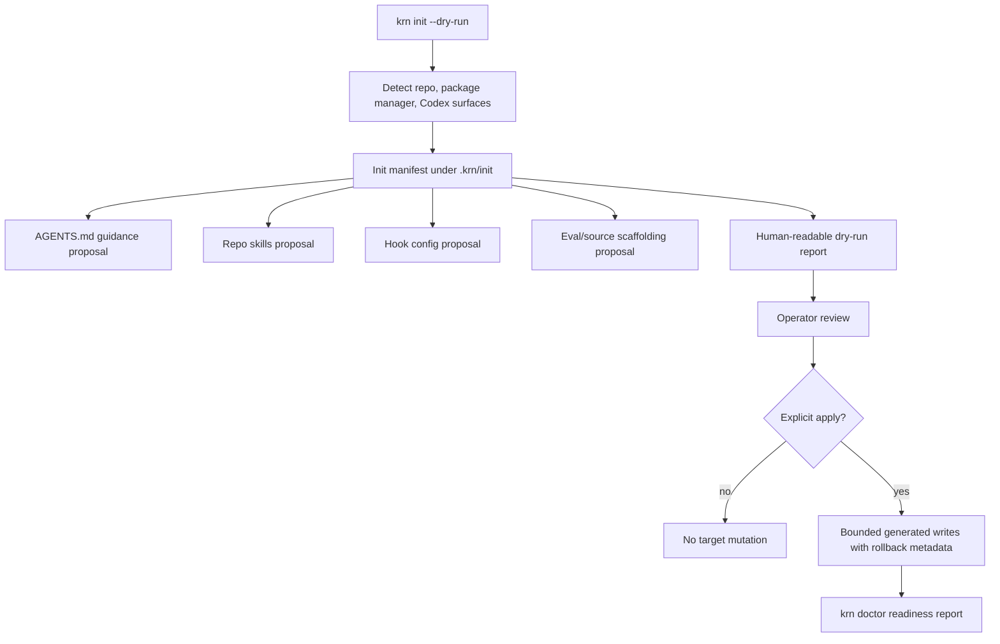
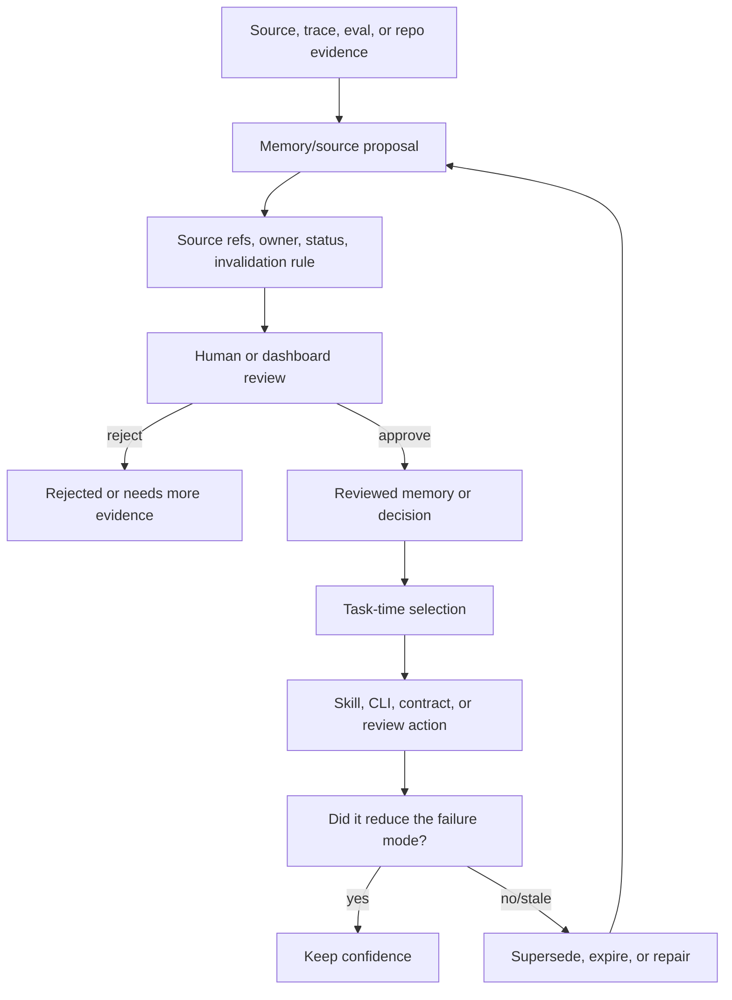
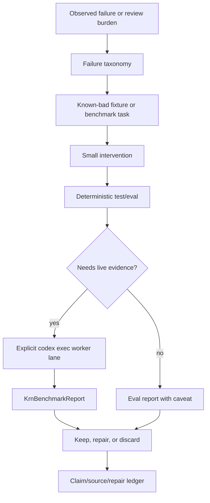
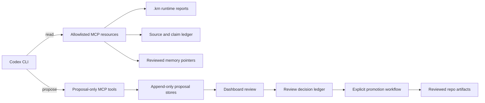
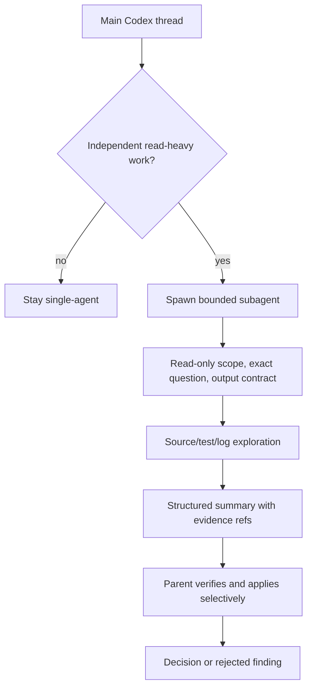
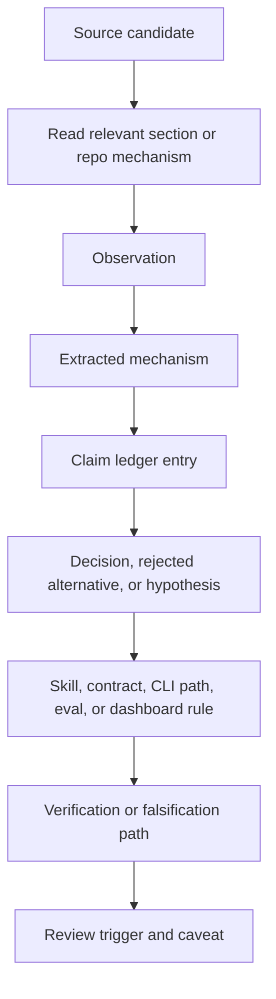

# KRN-GAS-TOWN - Canonical Synthesis

## 1. Executive Thesis

[DECISION] KRN should be a Codex-native operating memory, eval, and control plane. Gas Town is the repo/codename for building it. `krn init` is the bootstrap entry point, not the product boundary. The product wins only if it reduces repeated Codex failure modes through source-backed memory, trace-derived evals, deterministic hooks, explicit MCP/API boundaries, and a dashboard for human review.

[HYPOTHESIS] This can become a breakthrough wedge if it proves measurable improvement on real KRN tasks. It is not a proven breakthrough today.

[DECISION] The execution source of truth is now this canonical blueprint plus [docs/goals/goal-038.md](/home/krn/coding/krn/active/krn-gastown/docs/goals/goal-038.md). [docs/product/final-product-plan.md](/home/krn/coding/krn/active/krn-gastown/docs/product/final-product-plan.md) is a compatibility pointer, while `goal-006` and `goal-037` are historical evidence. `goal-005` is no longer the active product direction; it is Slice 2 context for `krn init --dry-run`.

[DECISION] [docs/goals/goal-038.md](/home/krn/coding/krn/active/krn-gastown/docs/goals/goal-038.md) absorbs the `goal-037` engineering-kernel reset into one final-product endgame. Non-trivial work must remain mechanism-first, bottleneck-led, production-shaped, context-budgeted, diff-literate, review-minimizing, memory-operative, proof-carrying, and deletion-friendly.

[DECISION] The first final-product bottlenecks after reset are the `MemoryStore` boundary, pre-edit engineering gate, bounded context packet, local source graph check, eval-lane split, final-shaped `krn init --dry-run` bootstrap, and the reviewed `agent_instructions`, `local_config`, `source_pointers`, and `context_pointers` proposal/apply paths. They keep memory outside repo-file truth, select IDs with reasons/confidence/source lineage, apply guidance to a real CLI/review/context consumer, record runtime IDs and feedback, fail context dumps, reject selected memory without application guidance, block stale/conflicting selected source refs, keep lab/dashboard/benchmark history out of default verification, expose bootstrap capabilities without direct dry-run mutation, write the first absent `AGENTS.md` only through approved review plus exact payload promotion, write the minimal `.krn/config.toml` only as an exact reviewed local-config payload that points to an external local MemoryStore, write the minimal `.krn/sources/index.json` only as an exact reviewed source graph seed that does not copy active source truth, and write the minimal `.krn/context/index.json` only as an exact reviewed context pointer seed that does not copy memory bodies, active task truth, `goal-038`, or the canonical draft. The next useful bottleneck is eval/skill/policy bootstrap readiness or repo-bootstrap readiness, not another passive planning artifact, dashboard, benchmark, broad API/cloud sync, or research runtime.

The short version:

```text
Codex work -> trace/source/eval artifacts -> reviewed memory and decisions -> better future Codex work -> dashboard-controlled review loop
```

## 2. What Changed After Merging First and Second Approach

[FACT] The two `SOURCES.md` files are identical. [FACT] The two draft files differ only in the final source-index path line. Therefore, the canonical plan is not a compromise between two competing approaches.

[DECISION] Treat the previous draft as a useful baseline and add the missing layer: OpenAI docs-first constraints, memory-system papers, benchmark evidence, long-running goal mechanics, GitHub project research, and dashboard/control-plane object design.

## 3. Product Identity and Breakthrough Verdict

Primary identity: source-backed operating memory and control plane for Codex work.

Secondary surfaces:

- CLI: `krn init`, `krn doctor`, `krn eval`, `krn sync`.
- Codex layer: `AGENTS.md`, skills, subagents, hooks, MCP, config.
- Memory layer: source-backed entries, review states, temporal validity, invalidation.
- Eval layer: micro/macro/trace-derived evals.
- Dashboard: Memory Core, pending review, gaps, sources, graph view, ownership, approvals.

What KRN is not:

- not a Codex replacement,
- not a dashboard-first productivity product,
- not a generic multi-agent swarm,
- not a vector DB wrapper,
- not a prompt pack.

Breakthrough criterion:

KRN becomes defensible only if baseline Codex vs KRN-scaffolded Codex shows lower repeated failure rate, better source discipline, better post-compaction continuity, and lower review burden.

## 4. Research Method and Evidence Tiers

Every major decision must follow:

```text
source -> observation -> pattern -> mechanism -> KRN implication -> eval/falsification -> failure mode
```

Labels:

- `[FACT]`: verified in source or local files.
- `[INFERENCE]`: reasoned from evidence.
- `[HYPOTHESIS]`: plausible, not yet proven.
- `[DECISION]`: chosen product direction.
- `[BLOCKED]`: important but currently unverifiable.

Stars, social posts, and benchmark rankings are discovery signals, not proof.

## 5. Pattern Synthesis by Application Layer

| Layer | Primary pattern | Fallback | Kill criterion |
|---|---|---|---|
| Product identity | Codex operating memory/eval/control plane | CLI bootstrapper | No measurable workflow lift |
| Codex bootstrap | Minimal AGENTS + generated scaffold + dry-run | Manual docs only | Init output is not explainable |
| Agent-computer interface | Machine-readable CLI/API, JSONL, schemas | Human markdown reports | Agent cannot consume output reliably |
| Long-running goals | `/goal` + ExecPlan + checkpoints | Normal prompt + handoff doc | No evidence-based completion |
| Memory kernel | Source-backed temporal memory entries | File-based docs memory | Memory used as truth without sources |
| Source ledger | Stable source IDs + claim ledger | One SOURCES file | Claims cannot be audited |
| Operator skills | Normalized build pipeline | Ad hoc prompts | Skills become disconnected ceremony |
| Runtime skills | Small tested product skills | AGENTS.md references | Skill trigger drift or bloat |
| Subagents | Narrow read-only research/review | Single-agent pass | Parallelism lowers quality |
| Hooks | Deterministic lifecycle gates | Manual checklist | Hooks hide semantic decisions |
| MCP/API | Small allowlisted append-only bridge | Local files only | Unsafe or untraceable writes |
| Evals | Trace-derived micro/macro evals | Manual review matrix | Green tests do not predict review |
| Dashboard | Review/control UI over memory/source/eval objects | Markdown reports | Metrics have no owner/action |
| Security | Least-power, dry-run, approval-first | Read-only/proposal-only first slice | Users bypass guardrails |

## 6. Architecture Graphs

These graphs are the canonical compact architecture map required by the original research goal. They are deliberately product-shaped, not a promise that every edge is already implemented.

### Graph 1 - Product End To End



Mechanism: source-backed operating loop. Verification: every edge needs a typed object, generated artifact, eval, or review record before it can be claimed as implemented.

### Graph 2 - `krn init`



Mechanism: dry-run and manifest before mutation; exact target writes require approved review plus promotion. Verification: parser tests, `krn init --dry-run`, `krn init --proposal agent_instructions`, and `krn init --apply agent_instructions` evidence prove only one reviewed absent-`AGENTS.md` write boundary, not broad bootstrap or merge-mode safety.

### Graph 3 - Long-Running Codex Goal

```mermaid
flowchart TD
  Goal[/goal objective or goal file] --> Contract[Outcome, evidence, constraints, blocked condition]
  Contract --> Plan[Execution plan or active child goal]
  Plan --> Work[Small vertical slice]
  Work --> Evidence[Tests, evals, artifacts, diff]
  Evidence --> Audit[Requirement-by-requirement completion audit]
  Audit -->|complete| Close[Mark goal complete]
  Audit -->|gap| Next[Record next concrete action]
  Next --> Checkpoint[Compact checkpoint selector]
  Checkpoint --> Resume[Resume from files, not chat memory]
  Resume --> Plan
```

Mechanism: goal autonomy constrained by evidence and selectors. Verification: completion requires direct evidence for each explicit requirement, not plausible progress.

### Graph 4 - Memory Lifecycle



Mechanism: memory is useful only when selected, applied, reviewed, and measured. Verification: the next product slice should prove selection/application, because file-backed notes alone are only an audit substrate.

### Graph 5 - Eval Loop



Mechanism: evals protect contracts or measured hypotheses. Verification: green evals state what they do not prove, especially around productivity lift.

### Graph 6 - API Bidirectional Sync



Mechanism: pull current truth, push proposals. Verification: read models and proposal stores are separate; destructive writes remain out of the default boundary.

### Graph 7 - Subagent Delegation Model



Mechanism: isolate noisy exploration without outsourcing product decisions. Verification: subagents should reduce context pollution or wall time; otherwise they are coordination overhead.

### Graph 8 - Source To Decision Pipeline



Mechanism: sources are not decoration. A source supports KRN only when it changes a decision, behavior, eval, or rejection.

## 7. OpenAI / Codex Surface Decisions

[DECISION] Official OpenAI/Codex docs are the source of truth for Codex-specific design.

Codex surfaces and KRN use:

- `AGENTS.md`: minimal always-loaded operating contract and pointers to progressive docs. It must not become a knowledge base, source index, stale path map, or collection of one-off hotfix rules.
- Skills: reusable workflow packages with trigger tests.
- Subagents: explicit, narrow, bounded parallel work.
- Hooks: deterministic capture/gates, including future compaction checkpoints.
- MCP: explicit resource/tool bridge to KRN state.
- Memories: helpful local recall, not project truth.
- `codex exec`: worker lane for CI, evals, repair passes, and structured reports.
- `/goal`: interactive long-running objective lane.
- App server/SDK: later integration surfaces for dashboard/control, not first-slice dependency.

Important constraint:

`codex exec` does not replace a continuous interactive Goal loop. It can run a bounded worker pass, stream JSONL, produce structured output, and sometimes resume a session, but KRN continuity must live in checked-in artifacts and run ledgers.

## 8. Long-Running Goal Mechanism

Use three layers:

1. Goal contract:
   - outcome,
   - verification surface,
   - constraints,
   - boundaries,
   - iteration policy,
   - blocked stop condition.
2. ExecPlan/state file:
   - self-contained plan,
   - current progress,
   - decisions,
   - surprises,
   - validation status,
   - next step.
3. Compact continuity:
   - `PreCompact` writes latest checkpoint,
   - `PostCompact` forces state reload,
   - dashboard later shows "continuity health".
Early hook test:

```text
PreCompact(auto/manual)
  -> write checkpoint with active goal, files, decisions, blockers, next action
  -> block only if checkpoint cannot be written

PostCompact(auto/manual)
  -> require reading docs/memory/INDEX.md, active goal, latest checkpoint
  -> continue only after state is restated from files
```

[HYPOTHESIS] This will materially improve post-compaction continuity. It must be tested with real hooks before being presented as proven.

[DECISION] Do not solve context rot by loading more context. Solve it by ranking context: current user instruction, compact checkpoint, memory index, then selected canonical docs.

## 9. Memory Kernel Architecture

Memory entry schema should include:

- `id`
- `type`: `fact`, `decision`, `pattern`, `failure`, `preference`, `source_note`, `checkpoint`
- `status`: `draft`, `ai_suggested`, `needs_review`, `approved`, `stale`, `superseded`, `rejected`
- `claim`
- `evidence_refs`
- `source_ids`
- `created_at`
- `valid_from`
- `expires_at`
- `invalidates_when`
- `confidence`
- `owner`
- `access`
- `linked_entries`
- `eval_refs`
- `review_notes`

The current bootstrap substrate can be markdown files under `docs/memory`, but the product claim starts only when a selection/application path consumes those entries. Later it can become a proper store/API, but the schema must stay source-backed and reviewable.

Best extracted patterns:

- Mem0/Zep: memory is extraction/consolidation/retrieval over time, not dumping all context.
- LongMemEval: test temporal updates and abstention, not only recall.
- A-MEM: link memories dynamically but avoid unreviewed graph noise.
- Hindsight: separate facts, experiences, entity summaries, and beliefs.
- MemPalace critique: local verbatim storage can be powerful, but spatial metaphor is not automatically the cause of retrieval quality.

## 10. Source and Claim Ledger

`SOURCES.md` is not bibliography decoration. It is the input to the claim ledger.

Required source workflow:

1. Add source candidate.
2. Extract observation.
3. Mark tier and caveat.
4. Create or update claim.
5. Map claim to decision.
6. Define failure if claim is wrong.

Unsupported claims must be marked `[HYPOTHESIS]` or removed.

## 11. Skills, Subagents, Hooks, MCP Architecture

KRN has two skill layers. They must not be mixed.

Layer A: operator/build-time skills. These are the skills used to build KRN itself. They should behave like a normalized senior-engineering pipeline:

```text
operator-router -> setup-operating-layer -> grill-domain -> decision-map -> to-prd -> to-adr when needed -> to-issues -> prototype-question when needed -> implement-vertical -> review-change -> handoff -> verify-release
```

This borrows the mechanism from `mattpocock/skills`: clarify ambiguity before building, use PRD/issues as phase boundaries, create ADRs only for meaningful tradeoffs, keep TDD vertical, and use handoff files when a fresh context is better than compaction.

For the current Codex repo, P1 operator skills live under `.agents/skills`, not `.codex/skills`. The first gate is static contract quality: trigger, input, output, phase boundary, when-not-to-use, and eval binding. The second gate is impact: baseline Codex vs skill-assisted Codex on the same task fixture. Do not claim productivity lift until the impact gate exists.

Layer B: runtime/product skills. These are skills and tool workflows exposed by KRN to improve future Codex work:

- `research-synthesis`
- `source-ledger`
- `goal-execplan`
- `memory-entry-review`
- `eval-designer`
- `dashboard-object-model`
- `github-solution-research`

Every skill in both layers needs trigger tests, input/output contract, phase boundary, and a "when not to use" section.

Subagents:

- use for bounded research, source verification, security review, eval design, or dashboard object critique,
- default to read-only,
- return structured handoff only,
- never spawn recursively unless explicitly approved.

Current hook surface:

- `compact-continuity`: project-local PreCompact/PostCompact checkpointing and resume hints.

Non-hook policies:

- source-claim checks,
- memory-write review,
- anti-slop constraints,
- eval-after-change rules,
- dangerous-action review.

These start as eval/CLI/docs contracts. They become hooks only if a deterministic event boundary, clear failure mode, and trusted local enforcement path are proven. Do not add prompt hooks or semantic reviewer hooks as the default solution.

MCP/API:

- resources: project profile, source index, memory pointers, eval results, latest run state,
- tools: propose memory, append source, write trace, record decision, request eval, publish dashboard event,
- writes: append-only, idempotent, schema-versioned, approval-aware.

ChatGPT reviewer bridge:

- deferred optional reviewer channel after the local Codex/KRN loop proves useful,
- possible later first step: ChatGPT Project/custom GPT as a static reviewer over uploaded KRN docs,
- possible later live step: read-only HTTPS MCP gateway for sources, claims, memory entries, eval results and compact state,
- only after that, if still useful, add proposal-only writes visible in the dashboard,
- never describe the bridge as direct ChatGPT-to-local-Codex stdio; Codex can run as an MCP server over stdio for another local tool, while ChatGPT connectors need a reachable app/gateway endpoint.

## 12. Evals and Improvement Loop

KRN eval ladder:

1. Micro evals:
   - skill trigger,
   - schema compliance,
   - source citation,
   - hook behavior,
   - memory proposal validity.
2. Workflow evals:
   - research synthesis,
   - long-running goal continuation,
   - repair loop,
   - dashboard proposal review.
3. Macro evals:
   - baseline Codex vs KRN Codex on repeated local tasks.

Improvement loop:

```text
real trace -> human/model feedback -> known-bad fixture -> proposed change -> train/validation split -> review -> release -> regression monitor
```

Promptfoo is a strong early runner candidate because it keeps eval configs near code and works in CLI/CI. OpenAI eval dashboards can inform patterns but should not become a first-slice dependency.

Early KRN metrics:

- `memory_routing_score`
- `source_grounding_score`
- `goal_alignment_score`
- `continuity_score`
- `anti_slop_score`
- `drift_resistance_score`

These are setup-compliance metrics, not breakthrough proof. Breakthrough proof still needs baseline Codex vs KRN-scaffolded Codex on real tasks.

## 13. Dashboard / Control Plane Architecture

The dashboard should look closer to the provided Memory Core UI than to a metrics homepage.

Objects:

- Memory Core: entries with type, state, confidence, owner, source count.
- Pending review: AI-proposed memory/source/eval/skill changes.
- Knowledge gaps: missing evidence, stale claims, failed recalls.
- Recently changed: changed entries and source freshness.
- Domains: Product, Processes, Roles, Decisions, Policies, Customers, Engineering.
- Sources: Notion/GitHub/Slack/Linear/Google Drive/local docs later.
- Detail panel: proposed edits, source evidence, linked entries, access, owner.
- Graph view: entities, claims, decisions, sources, evals.

Actions:

- approve,
- reject,
- request more sources,
- mark stale,
- supersede,
- link entries,
- inspect source/trace,
- promote failure pattern into eval,
- approve skill/prompt/hook proposal.

Dashboard rule:

Every metric must have an owner, action, source, and failure mode.

## 14. Security and Governance

Default posture:

- dry-run before writes,
- local-first,
- no secrets in memory,
- no raw transcript dumps in checked-in docs,
- hooks require trust review,
- MCP tools are allowlisted,
- destructive actions need explicit approval,
- dashboard writes create proposals, not silent mutations.

Early roles:

- owner: can approve memory and MCP write policies,
- reviewer: can approve/reject proposals,
- agent: can propose but not approve,
- viewer: can inspect approved state.

## 15. Market and Practitioner Comparison

Best practitioner patterns to keep:

- Matt Pocock / AI Hero: small skills inside a normalized operator pipeline, grill before ambiguous work, PRD/issues as phase boundaries, ADR only for real decisions, TDD/feedback loops, handoff over accidental context sprawl.
- Simon Willison: agentic engineering is emerging practice; cheap code increases need for review and taste.
- Addy Osmani: plan, chunk, review, run, test; human engineer remains accountable.
- LangChain / context engineering: write, select, compress, isolate context.
- Sandcastle: sandboxed worktree orchestration with iterations, logs, commits, warm environment, completion signal.

GitHub research rule:

Do not rank by stars. For each repo, inspect:

- actual mechanism,
- isolation model,
- state model,
- eval model,
- security posture,
- integration cost,
- what problem it actually solves,
- what KRN should borrow or reject.

## 16. Roadmap

| Slice | Outcome | Proof gate | Kill criterion |
|---|---|---|---|
| S1 | Operator build system | skill contract and impact evals protect workflow boundaries | Skills become disconnected prompts |
| S2 | Typed runtime spine | `pnpm typecheck`, `pnpm test`, valid/known-bad fixtures, schema-backed `.krn` reports | CLI output becomes prose or silently mutates targets |
| S3a | Read/proposal control plane | MCP resources and proposal stores are allowlisted, append-only, idempotent, and source-backed | Proposal refs become decorative or unsafe |
| S3b | Dashboard review surfaces | UI reads generated typed product objects only and every row has owner/source/action/failure mode | UI shows vanity metrics or chat-derived state |
| S3c | Benchmark and repair loop | live evidence stays explicit, lift remains unclaimed below the gate, no-lift creates repair records | Green fixture/live reports are overclaimed as productivity proof |
| Completed foundation | MemoryStore boundary, pre-edit gate, bounded context packet, source graph check, eval-lane split, final-shaped `krn init --dry-run` bootstrap, reviewed `agent_instructions`, `local_config`, `source_pointers`, and `context_pointers` proposal/apply paths | Store-backed selection/application/feedback, `krn gate`, `krn context build`, `krn sources check`, lane-aware `krn eval`, required init bootstrap capabilities, runtime IDs, rejected context dumps, selected-memory application guidance, source pass/warn/block decisions, lab exclusion by default, dry-run mutation rejection, exact absent-`AGENTS.md` write through approved promotion, exact absent-`.krn/config.toml` write through approved promotion with memory core kept behind `KRN_MEMORY_STORE_PATH`, exact absent-`.krn/sources/index.json` write through approved source graph seed promotion, and exact absent-`.krn/context/index.json` write through approved context pointer seed promotion | The proof is overclaimed as final memory/source/eval/context quality, broad repo bootstrap, merge-mode safety, research automation, broad config consumption, or productivity lift |
| Next | Eval baseline, skill wiring, policy boundaries, or repo-bootstrap readiness | KRN can move from reviewed agent/config/source/context target setup toward usable repo bootstrap without broad scaffolding, hardcoded truth, or repo-local memory-core fiction | Bootstrap writes broad scaffolding, hardcodes product truth, skips review/promotion, overwrites existing instructions, treats `.krn` as memory core, or creates more overhead than it removes |

## 17. Kill Criteria

Kill or redesign the product if:

- native Codex + small `AGENTS.md` gives same outcome,
- memory increases stale-confidence errors,
- dashboard does not create reviewed actions,
- evals fail to predict human review,
- hooks are bypassed or untrusted in real runs,
- `krn init` generates more overhead than it removes,
- users cannot explain what KRN changed.

## 18. Open Questions

- What is the smallest eval registry split that keeps core/current gates fast while parking lab/dashboard/benchmark history outside the default path?
- Should `docs/memory` remain markdown long-term, or become generated from a structured store after selection/application is proven?
- How aggressive should PreCompact blocking be?
- Should Sandcastle-like sandboxing be a KRN feature or only a reference pattern?
- What is the smallest dashboard object model worth prototyping?
- What is the next narrow `krn init` capability after exact `agent_instructions`, `local_config`, `source_pointers`, and `context_pointers` apply: eval baseline, skill wiring, policy boundaries, or repo-bootstrap readiness?
- Does `packages/cli/src/init-bootstrap.ts` need a stronger target registry before eval/skill/policy capabilities, or is the current payload boundary enough?

## 19. Decision Log

| Date | Decision | Reason |
|---|---|---|
| 2026-06-19 | Root `AGENTS.md` points to `docs/memory/INDEX.md`. | Keeps root instructions small and progressive. |
| 2026-06-19 | Root `AGENTS.md` upgraded to a normative anti-drift contract. | AGENTS.md is always loaded, so it must stay short, universal, source-aware, and docs-rot resistant. |
| 2026-06-19 | `codex exec` is worker lane, not continuous Goal loop. | Official non-interactive mode differs from `/goal` lifecycle. |
| 2026-06-19 | PreCompact/PostCompact continuity is a testable hypothesis. | Useful mechanism but needs real hook proof. |
| 2026-06-19 | Sandcastle added as GitHub research pattern. | Mechanism-level value: sandbox/worktree/log/commit orchestration. |
| 2026-06-19 | Dashboard is control plane over ledgers, not analytics. | Matches product hypothesis and user reference UI. |
| 2026-06-19 | Separate operator skills from runtime/product skills. | Matt Pocock-style skills are a build pipeline; KRN runtime skills are product capabilities. |
| 2026-06-20 | ChatGPT reviewer bridge is deferred and optional. | The local Codex/KRN operating loop, source-backed proposal store, dashboard, and benchmark lift matter before external reviewer integration. |
| 2026-06-19 | Cookbook links become pattern maps, not bibliography. | OpenAI examples matter when they change artifacts, evals, or stop conditions. |
| 2026-06-19 | `autoresearch` is a bounded metric-loop reference only. | Borrow baseline/metric/budget/keep-discard; do not import endless autonomy. |
| 2026-06-19 | Semantic policies stay out of hooks for now. | User rejected extra hooks, and OpenAI hook guidance fits deterministic lifecycle events better than semantic product truth. |
| 2026-06-20 | Goal 038 becomes the active final-product execution contract. | It absorbs the engineering-kernel reset and routes the next product slice toward the `MemoryStore` boundary plus selection/application proof. |
| 2026-06-20 | MemoryStore, pre-edit gate, and bounded context packet become the active execution path. | The next dependency is source graph freshness/conflict blocking, because selected memory/context now needs source quality controls before dashboard/API expansion. |
| 2026-06-20 | Local source graph check joins the active execution path. | `krn sources check` can pass, warn, or block selected context source refs; the next dependency is eval-lane split so default verification stops carrying lab history. |
| 2026-06-20 | Eval-lane split joins the active execution path. | Default `krn eval` now selects `core,current` and excludes `lab`; it is now the verification baseline for final-shaped init work instead of historical lab churn. |
| 2026-06-20 | Final-shaped `krn init --dry-run` bootstrap joins the active execution path. | Init manifests now expose seven required bootstrap capabilities and reject direct dry-run mutation; the next dependency is a reviewed first proposal/write target or surgical init-command extraction. |
| 2026-06-20 | First `krn init` bootstrap proposal target joins the active execution path. | `krn init --proposal agent_instructions` stores an append-only `init_bootstrap` proposal backed by the generated dry-run manifest and still leaves `AGENTS.md` untouched. |
| 2026-06-21 | First reviewed `krn init` apply target joins the active execution path. | `krn init --apply agent_instructions` writes an absent `AGENTS.md` only after an approved review decision and exact `init_agent_instructions` payload promotion, while keeping broad bootstrap, merge mode, dashboard, API/cloud sync, and memory-core writes out of scope. |
| 2026-06-21 | Second reviewed `krn init` apply target joins the active execution path. | `krn init --proposal/apply local_config` writes an absent `.krn/config.toml` only after an approved review decision and exact `init_local_config` payload promotion, while keeping memory bodies, active-goal truth, copied source lists, dashboard state, API sync, and cloud defaults out of repo config. |
| 2026-06-21 | Third reviewed `krn init` apply target joins the active execution path. | `krn init --proposal/apply source_pointers` writes an absent `.krn/sources/index.json` only after an approved review decision and exact `init_source_pointers` payload promotion, while keeping canonical source ledgers, active source lists, source bodies, dashboard state, API sync, and memory-core truth out of the seed. |
| 2026-06-21 | Fourth reviewed `krn init` apply target joins the active execution path. | `krn init --proposal/apply context_pointers` writes an absent `.krn/context/index.json` only after an approved review decision and exact `init_context_pointers` payload promotion, while keeping memory bodies, active task truth, `goal-038`, canonical draft text, dashboard state, API sync, and memory-core truth out of the seed. |

## 20. Source Coverage Checklist

- Total external sources: 98.
- Official OpenAI/Codex/Cookbook sources: S001-S021, S086-S087.
- Papers/benchmarks: S023, S025-S046, S047-S052.
- Memory sources: S023-S040.
- Coding-agent benchmark/interface sources: S041-S046.
- Practitioner/senior sources: S055-S065, S074-S077, S096-S098.
- Competitor/open-source sources: S067-S073.
- Deferred ChatGPT reviewer bridge sources: S078-S085.
- Controlled experiment-loop source: S088.
- Local evidence entries: LOCAL001-LOCAL056.
- Active reset claims: C059-C071.

Final verdict: KRN is not proven breakthrough yet. The strongest path is a disciplined source-backed control plane where Codex work produces reviewable memory, eval, trace, and decision artifacts, and where every future dashboard feature reads those artifacts instead of inventing state.
