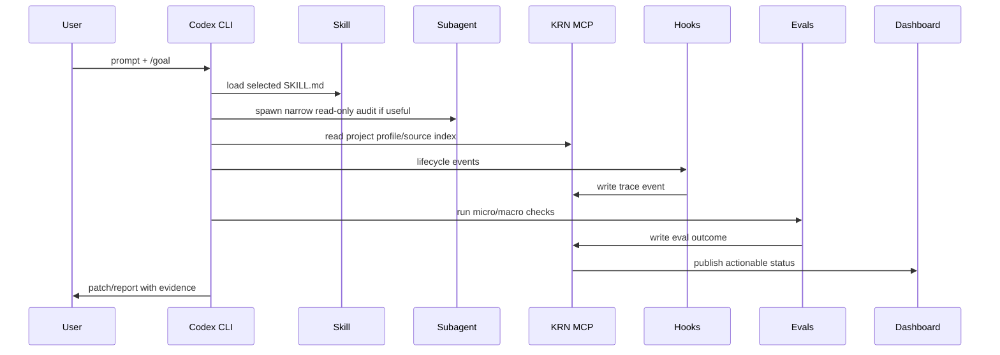
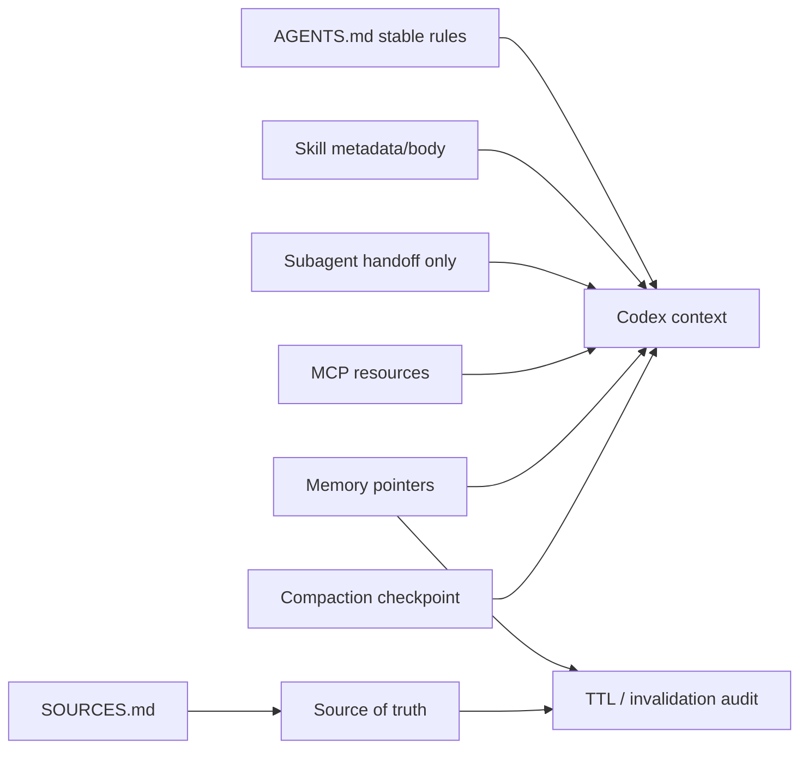
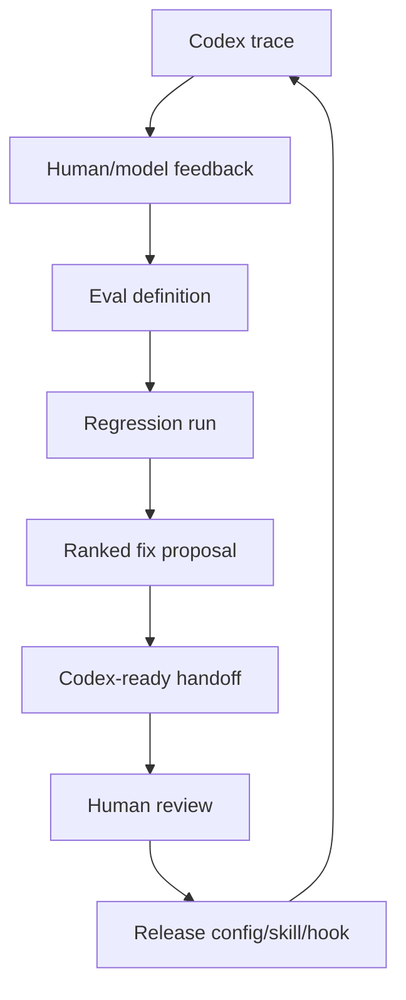
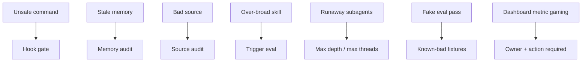
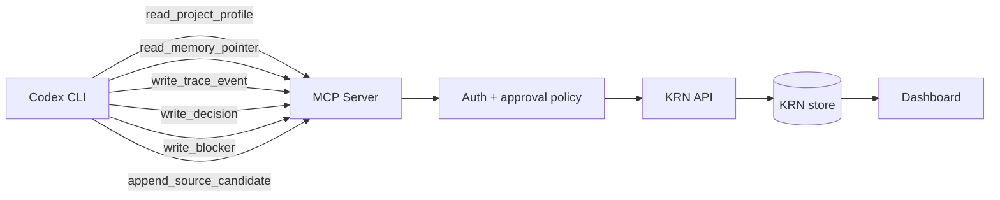
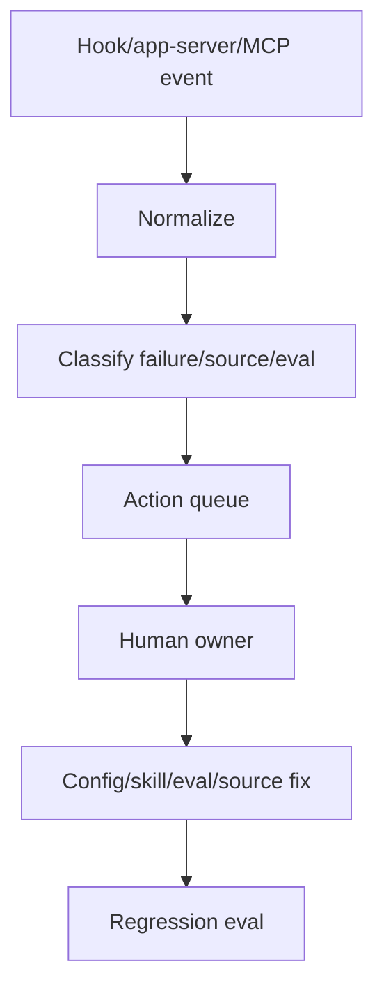

# krn-gas-town / krn init - evidence-backed product plan

## 1. Executive thesis

**Werdykt:** `krn-gas-town` wygląda jak użyteczna, Codex-first warstwa operacyjna, ale nie jak udowodniony przełom. Teza jest mocna tylko w wąskim znaczeniu: `krn init` może zmniejszyć powtarzalne błędy Codexa, jeżeli zamieni je w lokalne reguły, małe skills, wąskie subagents, kontrakty MCP/API, hooks, traces i evals. Jeżeli projekt stanie się dashboardem, paczką promptów albo "zespołem agentów" dla efektu, będzie market slop [S002][S003][S004][S005][S006][S007][LOCAL001].

**Produkt:** CLI-first bootstrap i control layer dla projektów, w których Codex CLI jest głównym wykonawcą. `krn init` ma utworzyć lub zaktualizować małą, audytowalną warstwę Codex infra: `AGENTS.md`, `.codex/config.toml`, `.agents/skills/**/SKILL.md`, `.codex/agents/*`, hooks, konfigurację KRN MCP/API, `SOURCES.md`, trace/event schema, eval docs i rollback metadata [S003][S004][S005][S006][S007].

**Nie-produkt:** nie zastępujemy Codex CLI, Claude Code, Cursor, Aider, Cline/Roo ani LangGraph. Nie budujemy autonomous company OS. Nie sprzedajemy "AI productivity" bez dowodu. Codex ma już natywne surfaces: goals, `AGENTS.md`, skills, subagents, hooks, MCP, memories i app-server; KRN ma sens tylko jako dyscyplina kompozycji tych surfaces oraz pętla evidence -> decision -> eval [S001][S002][S003][S008].

**Dlaczego teraz:** lokalnie zweryfikowano Codex CLI `0.141.0` [LOCAL002]. Oficjalne docs opisują `/goal`, `/skills`, `/mcp`, `/hooks`, `/memories`, `/agent`, project config, skills, subagents, hooks, MCP i app-server [S001][S002][S004][S005][S006][S007][S008]. Rynek ma podobne primitives: Claude Code ma memory, skills, hooks, subagents i MCP; Cursor ma rules; Aider używa repo map; Cline/Roo używają rules, modes i MCP [S017][S018][S019][S020][S021][S022][S023][S024][S025][S026][S027]. Luka nie brzmi "brakuje primitives"; luka brzmi "brakuje mierzalnej, lokalnej pętli operacyjnej".

**Teza falsyfikowalna:** po MVP trzeba uruchomić 20 powtarzalnych, realnych tasków KRN w dwóch wariantach: baseline Codex i Codex po `krn init`. KRN jest użyteczny tylko, jeśli poprawi co najmniej trzy metryki bez zwiększenia ciężaru review: mniej powtórzonych naruszeń instrukcji, mniej edycji złych plików, wyższy completion verification, mniej brakujących źródeł w researchu, mniej unsafe command attempts, szybszy handoff po compaction i lepszy trace-to-fix conversion. Jeżeli poprawią się tylko opisy promptów albo wykresy dashboardu, projekt należy uznać za slop [S009][S011][S012][S031][S032].

## 2. Product principle

**Minimal Karpathy-style leverage, not agent cosplay.** Deweloper nadal odpowiada za projekt, review i release. KRN ma usuwać powtarzalny koszt koordynacji pracy z Codexem, nie udawać, że więcej nazwanych agentów tworzy więcej inteligencji [S041][S042][S046].

Reguła projektowa:

| Pytanie | Decyzja domyślna | Kiedy eskalować |
|---|---|---|
| Czy to może być jedna reguła w `AGENTS.md`? | użyj `AGENTS.md` | dopiero gdy workflow wymaga plików, skryptów albo testów triggera [S003][S004] |
| Czy to może być jeden hook zamiast funkcji dashboardu? | użyj hooka i logu | dopiero gdy człowiek musi zobaczyć trend lub blocker [S006][S030] |
| Czy to może być dokument zamiast automatyzacji? | zostaw dokument | automatyzuj dopiero po powtórzonym błędzie w traces [S011][S012] |
| Czy pamięć może udawać źródło prawdy? | nie | pamięć przechowuje pointers, TTL i invalidation, nie pełną prawdę [S010][S018][S036] |
| Czy subagent zmniejsza kolizję kontekstu? | nie spawnuj domyślnie | spawnuj tylko dla audytu, researchu lub niezależnego review [S005][S020] |

Produkt nie może mieć komponentu bez: problemu, wzorca, mechanizmu, evala, failure mode i kill criterion.

## 3. Mega FAQ

1. **Czym dokładnie jest `krn-gas-town`?**  
   To Codex-first infrastructure layer: generator konfiguracji projektu, lokalny source/eval/trace scaffold i bezpieczny most MCP/API do KRN. Codex pozostaje wykonawcą, KRN jest warstwą operacyjną i audytową [S002][S003][S007].

2. **Dlaczego Codex CLI first?**  
   Workflow użytkownika jest terminalowy, a CLI daje powierzchnię kontroli: `/goal`, `/skills`, `/mcp`, `/hooks`, `/agent`, `/memories`, `/permissions`, `/status`, `/debug-config` oraz app-server/non-interactive paths [S002][S008][LOCAL002].

3. **Dlaczego nie samo `AGENTS.md`?**  
   `AGENTS.md` jest dobre dla stabilnych reguł repo, ale nie wystarczy dla zewnętrznego stanu API, trace IDs, eval results, hooks, skills, subagents i policy-controlled tool writes [S003][S004][S006][S007].

4. **Dlaczego nie sama biblioteka skills?**  
   Skills są progressive disclosure packages dla powtarzalnych workflow. Jeżeli skill tylko powtarza jedną preferencję, psuje trigger quality i discovery budget [S004].

5. **Dlaczego nie samo MCP?**  
   MCP daje realny dostęp do context/actions, ale bez allowlist, approvals, schemas, trace IDs i source policy staje się niebezpiecznym kanałem bocznym [S007][S015].

6. **Dlaczego nie Claude Code?**  
   Claude Code ma wiele dobrych primitives: memory, skills, hooks, subagents, settings i MCP. KRN nie konkuruje jako runtime; używa Claude Code jako punktu porównania, a targetem jest Codex CLI [S017][S018][S019][S020][S021][S022][S023].

7. **Dlaczego nie Cursor rules?**  
   Cursor rules pomagają w IDE, ale KRN celuje w repo-local Codex CLI operations, trace/eval loop i dwukierunkowy API bridge. Rules to tylko jeden składnik [S024].

8. **Dlaczego nie Aider repo map?**  
   Aider pokazuje, że selektywny context map jest lepszy niż wrzucenie całego repo. KRN powinien pożyczyć tę zasadę dla context manifests, nie zastępować Codexa [S025].

9. **Dlaczego nie Cline/Roo?**  
   Cline/Roo potwierdzają popyt na rules, modes i MCP, ale są IDE/extension centered. KRN ma być mniejszy: init, evidence, gates i evals dla Codex projects [S026][S027].

10. **Dlaczego nie LangGraph?**  
    LangGraph jest runtime dla durable graphs i human-in-the-loop. KRN nie potrzebuje własnego agent runtime w MVP; może użyć podobnych pojęć dla workflow/eval design i API state [S028][S029].

11. **Co robi `krn init`?**  
    Wykrywa projekt, pokazuje dry-run diff, tworzy/scala Codex operating files, ustawia source/eval/trace scaffold, proponuje hooks/MCP i zostawia rollback manifest [S003][S004][S006][S007][LOCAL004].

12. **Czego `krn init` nie robi?**  
    Nie nadpisuje cicho `AGENTS.md`, nie instaluje zaufanych hooks bez review, nie zapisuje sekretów, nie włącza destructive MCP tools, nie spawnje subagentów i nie robi commitów [S006][S007][S015][LOCAL004].

13. **Co pokazuje dashboard?**  
    Blockery, traces, eval outcomes, repeated failure modes, stale memory hits, source gaps, hook denials i task status. Nie pokazuje "produktywności" z liczby tokenów albo liczby agentów [S011][S012][S030].

14. **Co daje dwukierunkowe API?**  
    Codex może czytać project profile, rules, memory pointers, source index, eval results i task history; może pisać traces, decisions, blockers, source additions i eval outcomes. Wartość istnieje tylko przy JSON Schema, approvals i audit trail [S007][S008][S014][S015].

15. **Co nigdy nie powinno trafić do memory?**  
    Sekrety, credentials, raw customer data, niezweryfikowane claimy, stale task state, długie source dumps i wszystko, co powinno być cytowane w `SOURCES.md` [S010][S018][S015].

16. **Jak zapobiegać memory rot?**  
    Memory stores pointers: `source_ids`, `created_at`, `expires_at`, `invalidates_when`, confidence i owner. Audit degraduje wpisy do hypotheses zamiast wstrzykiwać je jako fakty [S010][S018][S036].

17. **Jak zapobiegać context rot?**  
    Warstwy muszą być rozdzielone: `AGENTS.md` dla reguł, skills dla workflow, MCP resources dla live data, `SOURCES.md` dla claims, compaction checkpoints dla bieżącego runu [S003][S004][S010][S025][S036].

18. **Jak zapobiegać skill bloat?**  
    Każdy skill ma trigger, non-trigger, required files, context budget, output contract, verification i kill criterion. Ryzykowne albo rzadkie skills nie powinny odpalać się implicit [S004].

19. **Jak zapobiegać subagent token explosion?**  
    Domyślnie `max_depth = 1`, małe `max_threads`, read-only roles i obowiązkowy handoff schema. Nie ma automatycznego fan-out dla zwykłych tasków [S005][S020].

20. **Jak mierzyć poprawę?**  
    Micro evals sprawdzają triggers, schemas, diff discipline i verification. Macro evals sprawdzają traces: routing mistakes, unresolved blockers, unsafe tools i repeated failures [S011][S012][S031][S032].

21. **Jaki jest najkrótszy MVP?**  
    `krn init --dry-run`, `krn doctor`, mały `AGENTS.md` strategy, 3-5 skills, 3 read-only subagents, jeden read-only KRN MCP endpoint, hook-based trace capture, lokalny JSONL event log i promptfoo-style evals. Bez dashboardu [S003][S004][S005][S006][S031].

22. **Co zrobiłoby z tego slop?**  
    Feature checklist kopiujący Codex, Claude, Cursor, Aider, Cline albo Roo bez mierzalnej redukcji failure modes, security policy i source-backed decisions [S002][S003][S004][S005][S006][S007][S017][S024][S025][S026][S027].

23. **Czy XML-style prompting ma sens?**  
    Tak, ale tylko w body promptów/skills dla izolacji i testowalności: `<task>`, `<inputs>`, `<constraints>`, `<output_contract>`, `<verification>`, `<stop_condition>`. Frontmatter YAML musi pozostać czyste [S004][S009].

24. **Jaka jest rola `SOURCES.md`?**  
    To evidence ledger, nie memory. Silny claim architektoniczny, rynkowy albo capability claim ma source ID albo status `[HYPOTHESIS]` [S009][S011][S012].

25. **Jaka jest rola hooks?**  
    Hooks robią deterministyczne rzeczy: logging, blocking known-dangerous actions, pre/post compact checkpoints, source/memory checks. Nie są pełnym sandboxem ani semantycznym reviewerem [S006].

26. **Jaka jest rola MCP?**  
    MCP jest jawny bridge do external state/actions: resources, tools i prompts z auth, schemas, approvals i audit trail [S007][S015].

27. **Czy app-server jest MVP dependency?**  
    Nie. App-server może być później podstawą local dashboard/control-plane clients, ale MVP może działać na hooks, local event log i MCP [S008][LOCAL003].

28. **Co musi zostać human-reviewed?**  
    Trust dla hooks, destructive MCP tools, persistent memory writes, baseline eval changes, dashboard conclusions, release decyzje i product code [S006][S015][S030].

29. **Jaki jest realny wyróżnik?**  
    Pętla: Codex run -> trace -> source/memory/eval update -> ranked improvement -> Codex-ready handoff -> review -> regression eval. Same primitives są już rynkowo dostępne [S011][S012][S030][S032].

30. **Co jest największą hipotezą?**  
    Że lokalny bootstrap realnie poprawi messy real work bez tworzenia kolejnego obowiązku konfiguracji. To wymaga traces przed dashboardem [S011][S012][LOCAL001].

31. **Co `krn init` daje senior engineerowi?**  
    Mniej powtarzalnego setupu, jawne source requirements, hooks dla znanych ryzyk, eval gates i mniejsze ryzyko złych plików po compaction [S003][S006][S010].

32. **Co jest kill criterion dla całego projektu?**  
    Jeżeli 20 realnych tasków nie pokaże mierzalnej poprawy albo użytkownik nie potrafi wyjaśnić wygenerowanych plików po `krn init`, zamykamy scope albo redukujemy do internal tooling [S011][S012][LOCAL004].

## 4. Paradoksy pracy z Codex / Claude Code-like agents

| Paradoks | Dlaczego powstaje | Obecny workaround | Szansa KRN | Metryka / eval | Dowód | Ryzyko |
|---|---|---|---|---|---|---|
| Autonomy vs control | Agent może działać szybko, ale realne akcje wymagają granic. | Approval prompts, sandbox, ręczny review. | permissions profile, hooks, eval gates. | unsafe command attempts, approval quality. | [S002][S006][S015] | Człowiek nadal może zaakceptować złą akcję. |
| More context vs more noise | Duże okno kontekstu nie jest źródłem prawdy. | Ręczne skracanie promptów. | context manifest, source index, repo-map-like pointers. | wrong-file edit rate. | [S010][S025][S036] | Model może przeważyć szum mimo selekcji. |
| Memory helps vs memory lies | Pamięć starzeje się i miesza fakty z preferencjami. | Manual notes. | TTL, source pointers, invalidation audit. | stale-memory incidents. | [S010][S018][S037] | Fakty zmieniają się poza KRN. |
| Compaction saves context vs loses nuance | Summary usuwa detale constraints. | Ręczne recap messages. | pre/post compact hooks i checkpoints. | post-compaction regression rate. | [S002][S006][S010] | Idealna kompresja nie istnieje. |
| Skills scale workflows vs skill bloat | Metadata skills konkuruje o discovery budget. | Mało skills albo chaos. | skill registry, trigger evals, kill criteria. | false trigger / missed trigger rate. | [S004] | Źle napisany skill pogorszy routing. |
| Subagents isolate context vs token explosion | Każdy subagent zużywa osobny kontekst i narzędzia. | Ręczne równoległe research passes. | max_threads, read-only roles, handoff schema. | tokens per accepted finding. | [S005][S020] | Legit research nadal może być kosztowny. |
| MCP gives power vs attack surface | Narzędzia zewnętrzne mogą czytać i pisać prawdziwy stan. | Ręczne API calls. | allowlists, approvals, schemas, trace IDs. | unsafe tool call attempts. | [S007][S015] | Untrusted MCP server behavior. |
| Hooks are deterministic vs false confidence | Hooks łapią zdarzenia, ale nie zastępują security modelu. | Shell scripts i review. | minimal blocking hooks plus audit. | hook bypass cases. | [S006] | Fałszywe poczucie pełnej ochrony. |
| `AGENTS.md` stabilizes vs junk drawer | Teams dopisują każdą preferencję na zawsze. | Jeden długi plik. | AGENTS lint, routing docs, generated block policy. | rule count vs repeated mistakes. | [S003][S002] | Brak jasnych team standards. |
| Goals enable long work vs wrong direction | Persistent goal może utrwalać zły cel. | Manual replanning. | goal templates and completion audit. | goal corrections per run. | [S009] | Zła decyzja produktowa nadal jest możliwa. |
| Evals create confidence vs eval theatre | Łatwe testy nie łapią realnych failure modes. | Demo checks. | trace-derived macro evals i known-bad fixtures. | eval-to-real failure correlation. | [S011][S012][S032] | Evale mogą zostać przeoptymalizowane. |
| Dashboard visibility vs bureaucracy | Wykresy łatwo stają się rytuałem. | Status docs. | blocker/failure dashboard only. | actioned findings per chart. | [S030] | Organizacyjne misuse metryk. |
| Negative prompting vs success definition | "Nie rób X" nie mówi, co jest wynikiem. | Długie listy zakazów. | output contracts and verification. | missing verification count. | [S009][S041] | Ambiguous tasks. |
| Faster generation vs slower review | Więcej kodu przesuwa bottleneck do zaufania. | Manual diff review. | diff discipline evals and review subagents. | review time per accepted change. | [S041][S042] | Human review capacity. |
| `krn init` simplifies vs hides complexity | Bootstrap może zmienić repo w sposób niejasny. | Manual setup. | dry-run, diff, rollback, doctor. | rollback frequency, user explanation test. | [S003][S006][LOCAL004] | Użytkownik nie czyta diffu. |
| Two-way API leverage vs coupling | External state pomaga, ale hidden state szkodzi. | Manual docs/API state. | append-only schema writes with source IDs. | orphan trace/write failures. | [S007][S008][S014] | API downtime albo stale state. |
| Local CLI control vs cloud parallelism | Lokalny run widzi prawdziwe środowisko; cloud skaluje równoległość. | Worktrees i terminale. | local-first traces, optional cloud handoff later. | local reproduction success. | [S001][S002] | Cloud product gaps pozostają. |
| Fast Codex versions vs stable promises | Vendor surfaces zmieniają się szybko. | Manual changelog reading. | `krn doctor` version matrix and drift warnings. | version drift incidents. | [S001][S002][LOCAL002] | Roadmap vendora jest poza kontrolą KRN. |

## 5. Research map i grafy architektury

| Sektor | Problem | Realny wzorzec | Implikacja produktu | Eval / verification | Failure mode | Kill criterion | Źródła |
|---|---|---|---|---|---|---|---|
| Codex capability surface | primitives są rozproszone | layered customization | `krn init` scala powierzchnie, nie zastępuje Codexa | doctor checks | duplikowanie native features | users nadal konfigurują wszystko ręcznie | [S002][S003] |
| Agent failure map | błędy powtarzają się w narzędziach, pamięci i evalach | trace-to-improvement loop | failure taxonomy + regression pack | trace classifier | taxonomy jako prose | brak redukcji po 20 runs | [S011][S012] |
| Prompting/instructions | duże prompty gniją | goals, output contracts, XML-like sections | krótkie kontrakty i source-backed decisions | adherence evals | rytualne XML | brak poprawy adherence | [S009][S013] |
| Memory/context | memory działa tylko z invalidation | pointer memory, compaction, repo maps | pamięć nie jest source of truth | stale-memory audit | stale injection | secret lub uncited claim w memory | [S010][S018][S025][S036] |
| Skills/subagents/hooks | zaawansowane primitives łatwo bloatują | progressive disclosure, narrow agents, deterministic gates | minimalna biblioteka | trigger/cost/hook tests | 50 fake agents | więcej primitives bez wyniku | [S004][S005][S006] |
| API/MCP | hidden API state jest niebezpieczny | typed tools/resources/prompts | KRN MCP z event IDs | schema/approval logs | unsafe writes | write bez audytu | [S007][S014][S015] |
| `krn init` | setup powtarza się per repo | dry-run generator | bootstrap Codex infra | file manifest tests | overwrite magic | users nie rozumieją outputu | [S003][S006] |
| Evals | green demos mylą | micro + macro evals | `krn eval run` przed dashboardem | known-bad fixtures | eval theatre | eval nie koreluje z run quality | [S011][S012][S031][S032] |
| Market | rynek ma primitives | tools rozwiązują fragmenty | KRN różnicuje się audit loop | side-by-side tasks | wrapper checklist | brak gap vs native Codex | [S017][S024][S025][S026][S027] |

### Graph 1 - capability / product layer graph

```mermaid
flowchart TD
  User[User] --> CLI[Codex CLI]
  User --> App[Codex App / IDE]
  CLI --> Goal[/goal]
  CLI --> Agents[AGENTS.md]
  CLI --> Skills[Skills]
  CLI --> Subagents[Subagents]
  CLI --> MCP[MCP tools/resources]
  CLI --> Hooks[Hooks]
  MCP --> API[KRN API]
  Hooks --> Trace[Local trace log]
  API --> Memory[Memory pointers]
  API --> Sources[SOURCES.md / source index]
  API --> Evals[Evals]
  Trace --> Evals
  Evals --> Dashboard[Dashboard later]
```

Pokazuje, że KRN nie jest agentem, tylko warstwą łączącą istniejące Codex surfaces. Ukryte ryzyko: MCP/API może stać się niewidzialnym źródłem stanu bez trace/source IDs [S002][S007][S008].

### Graph 2 - `krn init` file generation graph

```mermaid
flowchart TD
  Init[krn init --dry-run] --> Detect[Detect repo and Codex version]
  Detect --> AGENTS[AGENTS.md generated block]
  Detect --> Config[.codex/config.toml]
  Detect --> SkillsDir[.agents/skills/*/SKILL.md]
  Detect --> SubagentsDir[.codex/agents/*]
  Detect --> HooksFile[.codex/hooks.json]
  Detect --> MCPFile[KRN MCP config]
  Detect --> Sources[SOURCES.md]
  Detect --> EvalDocs[docs/ai/evals/*]
  Detect --> Events[.krn/events/*.jsonl local]
  AGENTS --> GitTracked[Git tracked]
  Config --> Review[Human review]
  HooksFile --> Trust[/hooks trust review]
  MCPFile --> Secrets[Secrets in env/local ignored config]
  Events --> Ignored[Git ignored]
```

Decyzja: generator musi zaczynać od dry-run diff i manifestu. Ryzyko: bootstrap ukryje zbyt dużo, jeśli użytkownik nie potrafi wyjaśnić wygenerowanych plików [LOCAL004].

### Graph 3 - runtime sequence



Decyzja: dashboard jest konsumentem zdarzeń, nie mózgiem systemu. Ryzyko: subagent output może zanieczyścić parent context bez handoff schema [S005].

### Graph 4 - Memory/context/source-of-truth graph



Decyzja: memory ma wskazywać na truth artifacts, nie zastępować ich. Ryzyko: użytkownicy mogą traktować pamięć jak bazę faktów [S010][S018].

### Graph 5 - eval loop graph



Decyzja: improvement loop ma zaczynać od traces, nie od dashboardu. Ryzyko: model-graded evals mogą być podatne na gaming bez review [S011][S012][S030][S031].

### Graph 6 - threat/failure graph



Decyzja: dla każdej klasy ryzyka istnieje konkretna bramka. Ryzyko: hooks nie są kompletną granicą bezpieczeństwa [S006].

### Graph 7 - two-way KRN API graph



Decyzja: API writes są append-only, schema-versioned i idempotent. Ryzyko: zbyt silne coupling, jeśli Codex nie może działać offline [S007][S014][S015].

### Graph 8 - dashboard telemetry graph



Decyzja: dashboard pokazuje kolejkę działań, nie narrację sukcesu. Ryzyko: telemetry bez ownership tworzy biurokrację [S030].

## 6. Codex capability model i warstwy produktu

| Codex surface | Co robi | Kiedy używać w KRN | Reguła |
|---|---|---|---|
| `/goal` | utrzymuje persistent objective | długie research/refactor/benchmark contracts | goal musi mieć outcome, evidence, constraints, boundaries i blocked stop condition [S009] |
| `AGENTS.md` | durable repo guidance | stabilne reguły, komendy, review expectations | krótko, z linkami do szczegółów [S003] |
| Skills | progressive-disclosure workflows | repeatable research, review, migration, eval workflows | trigger tests i context budget [S004] |
| Subagents | wyspecjalizowane child agents | read-only audits, source research, security review | explicit spawn, no default fan-out [S005] |
| Hooks | lifecycle command handlers | trace capture, source/memory checks, deny known bad operations | wymagają trust review [S006] |
| MCP | external tools/resources/prompts | KRN API read/write context and eval data | allowlists, approvals, auth, schemas [S007][S015] |
| Permissions/sandbox | ogranicza akcje | doctor checks i profile trust | tight defaults, no hidden escalation [S002] |
| App Server | JSON-RPC thread/turn/events/control | przyszły dashboard/control plane | nie MVP dependency [S008][LOCAL003] |
| Non-interactive / SDK | programmatic execution | CI evals albo batch audits later | używać dopiero po stabilizacji MVP [S008] |

### Product architecture by layers

| Warstwa | Cel / input | Output / co widzi Codex | Co zostaje poza kontekstem | Failure / eval | MVP / later | Dowód |
|---|---|---|---|---|---|---|
| KRN CLI | `krn init`, `krn doctor`, `krn eval`, `krn sync` | status, diff, run IDs | secrets, raw transcripts | overwrite / dry-run tests | MVP init/doctor; later sync | [S002][LOCAL004] |
| `krn init` | repo files + Codex version | merge patches | unreviewed trust | file manifest, rollback fixture | dry-run first | [S003][S006] |
| Codex config generator | project profile, trust level | `.codex/config.toml` blocks | user global prefs, tokens | config precedence mismatch | project config now, global story later | [S002][S007] |
| `AGENTS.md` strategy | repeated mistakes and review policy | short durable guidance | tutorials, source dumps | AGENTS lint | guarded block | [S003] |
| Skills library | repeatable workflows | selected `SKILL.md` body | unrelated skills | trigger precision/recall | 3-5 skills | [S004] |
| Subagent library | isolated read/review tasks | structured handoff | raw child transcript | cost/finding ratio | read-only roles | [S005] |
| MCP layer | KRN resources/tools | explicit tool/resource calls | hidden DB state, secrets | auth/schema/approval tests | read + trace writes | [S007][S015] |
| Hooks layer | lifecycle events | warnings, denials, trace events | semantic judgment | hook fixtures | trace/danger/source hooks | [S006] |
| Rules/permissions/sandbox | allowed actions | session policy hints | organization secrets | doctor warnings | conservative profile | [S002][S015] |
| Source index | source IDs and claims | cited pointers | full article copies | claim ledger audit | plan-local `SOURCES.md` | [S009][S011] |
| Memory/context | source-backed pointers | concise recall context | raw secrets, stale task state | TTL/invalidation tests | memory policy | [S010][S018][S036] |
| Eval layer | failure classes, fixtures | pass/fail reports | vanity charts | known-bad fixtures fail | local evals | [S011][S012][S032] |
| Trace/observability | hook/MCP/app events | run summaries, blocker IDs | private transcript bodies | schema/sampling tests | JSONL | [S008][S030] |
| Dashboard | event/eval/source views | actionable human state | unsupported claims | metric owner/action | later V2 | [S030] |
| KRN API | project intelligence store | MCP resources/tools | hidden model writes | local cache fallback | optional read first | [S007][S014][S015] |
| Local cache/event log | offline trace/rollback | local IDs and replay files | long-term sensitive storage | gitignore/TTL | `.krn/events` | [LOCAL004][S015] |
| Sync/auth/security | identity and permissions | auth status/errors | bearer tokens in repo | env-only secrets | env vars now, org auth later | [S007][S015] |

## 7. `krn init` architecture

Expected UX:

```bash
krn init --dry-run
krn init
krn doctor
krn goal <template>
krn sources audit
krn eval run
krn sync
krn dashboard
```

Bootstrap flow:

1. Detect repo type, package manager, test commands, existing `AGENTS.md`, `.codex`, `.agents`, MCP config, `SOURCES.md`, docs and lockfiles.
2. Detect Codex CLI version and available surfaces; warn when local version cannot support planned config [LOCAL002].
3. Build manifest of proposed files and exact diff.
4. Require explicit confirmation for hooks, MCP writes and generated subagents.
5. Write rollback manifest and `krn doctor` report.

| Plik / katalog | Strategia | Git tracked | Sekrety | Owner | Update trigger |
|---|---|---|---|---|---|
| `AGENTS.md` | create/merge guarded block | yes | no | repo | repeated rule failure |
| `.codex/config.toml` | create/merge | maybe | no | repo/operator | Codex version/profile change |
| `.agents/skills/**/SKILL.md` | create selected | yes | no | KRN skill owner | trigger eval failure |
| `.codex/agents/*` | create selected | yes | no | KRN agent owner | handoff/cost eval failure |
| `.codex/hooks.json` | propose | maybe | no | operator | hook trust review |
| `.krn/events/*.jsonl` | local create | no by default | may contain sensitive data | operator | hook/MCP trace |
| `SOURCES.md` | create/update | yes | no | research owner | source audit |
| `docs/ai/evals/*` | create | yes | no | eval owner | failure class added |
| `docs/ai/trace-schema.md` | create | yes | no | trace owner | schema version change |
| `.krn/rollback/*` | create local | no by default | no | operator | every init write |

Rollback rule: every write has file hash before/after, generator version, timestamp and manual reversal command. `krn doctor` checks parseability, missing sources, hook trust, MCP credentials, gitignore for local traces, eval fixture presence and source coverage.

## 8. Skills architecture

Skills są progressive-disclosure packages, nie personality files. Skill istnieje tylko, gdy workflow jest powtarzalny, ma wejścia/wyjścia, korzysta z references/scripts i nie mieści się jako krótka reguła w `AGENTS.md` [S004].

XML policy: XML-like tags są dozwolone wyłącznie w Markdown body, gdy poprawiają izolację i testowalność. YAML frontmatter musi pozostać czysty.

Proponowane MVP skills:

| Skill | Trigger | Kiedy nie używać | Output | Verification | Kill criterion |
|---|---|---|---|---|---|
| `source-backed-research` | research z zewnętrznymi claimami | prosta odpowiedź bez źródeł | source IDs + claim ledger | source audit | >10% unsupported claims |
| `codex-init-planner` | projekt potrzebuje `krn init` planu | jednorazowa reguła | manifest + risk list | dry-run check | użytkownik nie rozumie outputu |
| `agent-failure-audit` | trace pokazuje powtarzalny błąd | brak trace evidence | failure class + eval proposal | known-bad fixture | brak actioned findings |
| `skill-authoring-review` | nowy/zmieniony skill | zwykły prompt | trigger/non-trigger review | trigger fixtures | false triggers rosną |
| `mcp-contract-review` | nowy MCP tool/resource | read-only docs | schema/auth/approval review | JSON Schema tests | unsafe write path |

Valid `SKILL.md` template:

```markdown
---
name: source-backed-research
description: Researches sources and updates source-backed decisions. Use when a task requires external evidence, claim verification, or SOURCES.md updates.
---

<task>
Research claims, verify sources and update SOURCES.md.
</task>

<inputs>
- User question or goal.
- Existing SOURCES.md.
- Target document.
</inputs>

<constraints>
- Prefer official docs, specs, papers and repos.
- Do not cite a source unless the relevant section was read.
- Mark unsupported claims as [HYPOTHESIS].
</constraints>

<output_contract>
- Source entries with stable IDs.
- Claim ledger updates.
- Decision implications.
</output_contract>

<verification>
- SOURCES.md remains valid Markdown.
- Strong claims in the target doc cite [S###].
</verification>

<stop_condition>
Stop when additional sources do not change a decision, risk or eval.
</stop_condition>
```

## 9. Subagent architecture

Subagents są uzasadnione tylko wtedy, gdy izolują kontekst, umożliwiają równoległy research albo poprawiają review quality. Codex docs wskazują tradeoff kosztu i kontekstu, więc KRN nie może traktować subagents jako domyślnej odpowiedzi [S005].

Domyślny profil: `agents.max_depth = 1`, niski `agents.max_threads`, read-only dla research/review, wymagany handoff schema.

| Subagent | Misja | Input | Output | Tools | Preload skills | Stop condition | Token risk | Nie spawnuj gdy |
|---|---|---|---|---|---|---|---|---|
| `codex-docs-auditor` | verify Codex features | Codex terms | supported/unsupported matrix | OpenAI docs/web | research | no critical unknowns | low | non-Codex docs |
| `market-pattern-auditor` | compare competitors | tool list | gap table | web | research | no new decision changes | medium | product already decided |
| `source-ledger-reviewer` | audit citations | draft + sources | unsupported claims | rg/web spot checks | research | no blockers | low | no external claims |
| `skill-trigger-tester` | test skills | skill metadata | trigger fixture gaps | local files | skill review | fixtures listed | low | no skills |
| `hook-safety-reviewer` | review hooks | hook plan | safety findings | local files/docs | security | trust risks known | low | no hooks |
| `mcp-contract-reviewer` | review API tools | schemas | approval/auth issues | docs/schema | mcp review | no unsafe writes | medium | read-only docs |
| `memory-rot-auditor` | check memory policy | memory plan | TTL/invalidation gaps | docs | research | stale cases covered | low | no memory writes |
| `eval-designer` | derive evals | failure class | micro/macro tests | docs | eval | known-bad fixture exists | medium | no trace/failure |
| `frontend-proof-agent` | later dashboard UI proof | UI route | screenshot/evidence | browser | none | proof pack done | high | no UI exists |
| `release-risk-reviewer` | pre-release check | diff + evals | release blockers | local commands | review | all blockers triaged | medium | docs-only draft |

Handoff schema: `finding`, `evidence_refs`, `confidence`, `changed_decision`, `risk_if_wrong`, `recommended_action`, `stop_reason`.

## 10. MCP/API architecture

KRN powinien wystawić mały MCP server, nie szerokie, niejawne API. MCP jest właściwym mostem, bo Codex obsługuje MCP config, tool allowlists, auth i approval policies, a spec MCP definiuje resources, prompts, tools oraz zasady consent/security [S007][S015].

Required MCP resources:

| Resource | Purpose | Codex use |
|---|---|---|
| `krn://project/profile` | repo profile, stack, trust level | select rules/skills |
| `krn://sources/index` | source IDs and coverage | cite `SOURCES.md` |
| `krn://memory/pointers` | source-backed memory | recall with caveats |
| `krn://evals/latest` | recent eval outcomes | avoid known regressions |
| `krn://traces/recent` | recent failure classes | propose improvements |
| `krn://policy/current` | permissions and write policy | decide approval path |

All writes wymagają JSON Schema validation i powinny być append-only, idempotent, schema-versioned oraz provenance-bearing [S014]. Destructive lub state-changing tools defaultują do `prompt`/approval [S007].

### Required MCP/API tool candidates

| Tool | Cel | Input schema outline | Output schema outline | Idempotency | Auth/permissions | Rate limit | Retention | Failure/recovery |
|---|---|---|---|---|---|---|---|---|
| `krn.sources.search` | find source IDs | query, sector, trust_tier | source_ids, snippets, gaps | query hash | read | 60/min | logs only | stale index -> audit |
| `krn.sources.upsert` | add/update source | source_id?, url, title, claims, caveats | source_id, version | url+date | prompt | 20/min | permanent artifact | duplicate -> supersede |
| `krn.claims.link` | link claim to sources | claim_id, claim, source_ids, section | linked claim | claim_id | prompt | 60/min | ledger | weak evidence -> downgrade |
| `krn.memory.query` | retrieve pointers | topic, project_id, freshness | entries, confidence, refs | query hash | read | 120/min | access log | stale recall -> caveat |
| `krn.memory.propose` | propose memory write | claim, evidence_ref, ttl, invalidates_when | proposal_id | claim hash | approve | 30/min | pending audit | uncited -> reject |
| `krn.memory.invalidate` | expire memory | memory_id, reason, replacement_ref? | invalidation_id | id+reason | prompt | 30/min | permanent audit | active workflow -> require reason |
| `krn.traces.ingest` | append run event | trace_id, event_type, payload, refs | event_id | trace_id+seq | auto non-sensitive | 300/min | TTL policy | flood -> sample/backoff |
| `krn.eval.run` | request eval | eval_id, profile, input_refs | run_id, status | eval_id+input_hash | prompt if expensive | 10/min | eval history | unavailable -> queue |
| `krn.eval.result` | record eval result | run_id, status, scores, artifacts | result_id | run_id | auto | 60/min | summary permanent | partial -> incomplete |
| `krn.goal.status` | read/write goal progress | goal_id, status?, evidence_refs | status, blockers | goal_id+version | read/write prompt | 60/min | goal history | premature complete -> evidence gate |
| `krn.skill.install` | propose/install skill | skill_id, source, version, scope | install_plan/result | id+version | approve | 10/min | audit | unsafe -> quarantine |
| `krn.skill.audit` | inspect skill | skill_path/id | findings, score, fixes | id+version | read | 30/min | audit history | false score -> fixtures |
| `krn.dashboard.event` | publish UI event | event_type, refs, severity | dashboard_event_id | trace+type | auto | 300/min | dashboard TTL | vanity event -> drop |
| `krn.project.snapshot` | summarize AI infra | project_id, include_local | snapshot_id, manifest | project+hash | read/prompt | 20/min | TTL | missing files -> incomplete |
| `krn.decision.log` | append decision | decision, rationale, alternatives, sources | decision_id | decision hash | prompt | 30/min | permanent | unsupported -> hypothesis |

Architecture invariants: local cache works offline, secrets stay outside repo, dashboard reads events/decisions/evals/sources instead of inventing state, and every write can be tied back to a trace/source/eval ID [S014][S015].

## 11. Hooks architecture

Hooks robią deterministyczną pracę wokół lifecycle Codexa. Nie mogą stać się niewidzialną logiką produktu. Codex docs wymagają trust review dla command hooks i dokumentują ograniczenia interception, więc KRN nie może przedstawiać hooks jako kompletnego sandboxu [S006].

| Hook | Event | Działanie | Enforces | Nie enforces | Recovery |
|---|---|---|---|---|---|
| `trace-start` | session/turn start | append run metadata | trace exists | correctness | recreate from transcript summary |
| `pre-tool-danger` | before shell/tool | deny known destructive patterns | known-danger commands | unknown intent | manual approval path |
| `source-gap-check` | before final/docs write | warn on strong claims without `[S###]` | source discipline | source quality | run source audit |
| `memory-write-gate` | memory proposal | require evidence, TTL, invalidation | memory schema | truth | reject proposal |
| `compact-checkpoint` | before/after compact | write constraint summary | continuity | perfect summary | human review |
| `eval-after-change` | after config/skill/hook change | trigger local eval | regression signal | semantic release safety | block until triaged |

Detailed hook matrix:

| Event / matcher | Action | Enforces | Cannot enforce | False-positive risk | Recovery |
|---|---|---|---|---|---|
| shell command contains destructive pattern | block or require approval | obvious unsafe commands | malicious equivalent | blocks legitimate cleanup | documented override |
| final answer with docs changes | scan for missing citations | citation presence | citation relevance | over-warning on hypotheses | source-ledger review |
| write to `SOURCES.md` | validate ID uniqueness | stable source IDs | source truth | duplicate false alarm | supersede source |
| write to skill files | run trigger checklist | skill quality gate | actual model choice | slow authoring | skip with reason |
| MCP write tool call | require schema and trace ID | auditable writes | business correctness | schema too strict | manual schema update |
| compaction request | save checkpoint | continuity | all nuance | noisy checkpoint | human prune |

Hook output nie zapisuje persistent memory bez osobnego MCP/API review.

## 12. Memory/context architecture

Memory layers:

| Layer | Co przechowuje | Gdzie | Jak trafia do kontekstu | Invalidation |
|---|---|---|---|---|
| `AGENTS.md` | stabilne reguły repo | repo | always/near always | rule audit |
| Skills | workflow details | `.agents/skills` | metadata first, body on selection | trigger eval failure |
| Subagent handoffs | structured findings | thread summary / trace | summary only | parent review |
| MCP resources | live external state | KRN API | explicit read | API freshness |
| `SOURCES.md` | cited evidence | repo | source IDs/snippets | source audit |
| Memory pointers | reusable facts/preferences | KRN memory/local memory | only with caveat | TTL + invalidates_when |
| Compaction checkpoint | current-run constraints | trace/log | after compaction | next checkpoint |

Detailed memory policy:

| Memory type | Can store | Must not store | TTL | Invalidation | Retrieval | Verification | Rot risk |
|---|---|---|---|---|---|---|---|
| Project preference | stable user/team preference | one-off mood | 90 days | user says changed | topic query | source/evidence ref | medium |
| Source pointer | source ID and claim summary | full article copy | until source audit | source superseded | by claim/topic | URL/local check | low |
| Failure pattern | repeated trace class | single anecdote as fact | 30-60 days | eval no longer fails | by failure class | trace refs | medium |
| Tool policy | allowed/denied action class | secrets | 30 days | config change | by command/tool | doctor check | high |
| Decision log | decision + rationale | unsupported opinion | permanent with supersession | newer decision | by topic | source/eval refs | medium |

Memory entry schema: `claim`, `evidence_ref`, `source_ids`, `created_at`, `expires_at`, `confidence`, `owner`, `invalidates_when`. Audit może demote/delete/refresh, ale nie może po cichu przepisać source truth [S010][S018][S036].

## 13. Evals and improvement loop

Micro evals:

| Eval | Target | Pass condition |
|---|---|---|
| skill trigger | skill metadata | expected trigger/non-trigger outcomes |
| prompt adherence | goal/templates | output contract complete |
| output schema | MCP/API writes | JSON Schema validates |
| diff discipline | file edits | only intended files changed |
| source discipline | docs/research | strong claims cite sources |
| hook behavior | dangerous commands | known-bad fixtures blocked |

Macro evals:

- repeated instruction misses across traces.
- routing mistakes between `AGENTS.md`, skills, subagents, hooks and MCP.
- unresolved blockers after final answer.
- unsafe MCP/shell attempts.
- memory entries invalidated later.
- review rework per accepted change.

Required metrics:

| Metric | Definition | Why it matters | Anti-gaming |
|---|---|---|---|
| task success rate | accepted task / attempted task | core value | human review label |
| verification completion | completed checks / required checks | prevents done-claims | command evidence |
| diff precision | intended files / changed files | prevents broad edits | file manifest |
| unnecessary changes | unrelated edits count | scope control | review gate |
| source coverage | strong claims with `[S###]` | research quality | source relevance spot check |
| unsupported claims | claims without evidence | anti-slop | downgrade to hypothesis |
| memory staleness | stale hits / memory recalls | memory rot | count harmless stale hits too |
| hook catch rate | caught known-bad cases | deterministic guard quality | known-bad fixtures |
| MCP failure rate | failed tool calls / all calls | API reliability | include approval/schema errors |
| human intervention | manual fixes per run | real cost | normalize by task |
| slop score | weighted bloat/hype/unsupported features | product discipline | must map to kill criteria |

Slop score rubric:

| Signal | Points |
|---|---|
| component has no failure mode | +2 |
| component has no eval | +2 |
| claim has no source/hypothesis marker | +2 |
| dashboard metric has no owner/action | +1 |
| subagent exists without context isolation reason | +2 |
| skill duplicates one `AGENTS.md` rule | +1 |
| MCP write lacks schema/approval | +3 |

Config/skill/hook release is blocked if slop score exceeds threshold agreed for the repo.

## 14. Dashboard plan

Dashboard is V2, not MVP. It should show:

- active goals, blockers and evidence status.
- recent traces grouped by failure class.
- eval trend and known-bad fixture status.
- source gaps and stale source warnings.
- memory invalidations and stale recall incidents.
- hook denials and MCP approval/failure rates.
- action queue with owner and next verification.

It must not claim:

- productivity from token count.
- agent quality from number of subagents.
- trust from green evals without coverage.
- source truth from memory.
- release readiness without human review [S030].

Every visible metric needs owner, action and kill/ignore rule.

## 15. Market comparison

| Obszar | Istniejące rozwiązanie | Gap | Szansa KRN | Ryzyko slop | Dowód |
|---|---|---|---|---|---|
| Context management | Codex `AGENTS.md`, skills, MCP; Aider repo map | manual composition | context manifest + source-aware memory | another rule pack | [S003][S004][S025] |
| Memory | Codex/Claude memory | stale/uncited memories | pointer memory with invalidation | memory magic | [S010][S018] |
| Skills | Codex/Claude Agent Skills | trigger drift/bloat | skill tests and minimal library | giant marketplace | [S004][S019] |
| Subagents | Codex/Claude subagents, Roo modes | cost/handoff quality | explicit read-only subagents | fake team | [S005][S020][S027] |
| MCP/tools | Codex/Claude/Cline MCP | attack surface | schema, approval, trace IDs | unsafe API bridge | [S007][S015][S023] |
| Hooks/guardrails | Codex/Claude hooks | incomplete enforcement | deterministic trace/gates | false security | [S006][S021] |
| Evals | promptfoo, LangSmith, OpenAI macro evals | not tied to local Codex runs | trace-derived local eval pack | green demo evals | [S011][S030][S031][S032] |
| Observability | LangSmith/app-server/telemetry | product-specific | lightweight KRN events | vanity analytics | [S008][S030] |
| Long-running tasks | Codex Goals | goal needs evidence contract | templates + completion audit | endless backlog | [S009] |
| API integration | MCP/app-server/SDKs | hidden coupling risk | typed two-way KRN API | brittle state machine | [S007][S008][S014] |
| Security | MCP consent, hooks, sandbox | misconfiguration | `krn doctor` security checklist | policy theatre | [S006][S015] |
| Developer UX | Cursor rules, Cline/Roo modes | tool-specific setup | one `krn init` for Codex projects | over-generated files | [S024][S026][S027] |

KRN differentiates only if its eval/trace/source loop beats native Codex setup on real KRN tasks. Otherwise native Codex plus a good `AGENTS.md` is simpler.

## 16. Roadmap

| Milestone | User-visible value | Files/components | Eval gate | Risk | Kill criterion |
|---|---|---|---|---|---|
| MVP | `krn init --dry-run`, `krn doctor`, minimal Codex scaffold | `AGENTS.md`, `.codex/config.toml`, `SOURCES.md`, 3 skills, 3 agents, trace schema | generated file audit, trigger fixtures, doctor pass | over-generation | users cannot explain output |
| V1 | safe two-way KRN MCP/API and local event log | resources, trace/source/blocker writes, hooks | schema/auth/hook fixtures, 10 real traces | unsafe writes | unapproved state mutation |
| V1.5 | local eval pack | promptfoo-style fixtures, slop score, known-bad cases | known-bad fails before fix and passes after | eval theatre | evals do not predict review |
| V2 | dashboard from events | action queue, source/memory/eval views | every metric has owner/action | bureaucracy | charts do not produce fixes |
| V3 | org profiles and distribution | skill packs, policies, sync, auth | multi-project drift tests | platform sprawl | setup burden exceeds benefit |

Stage roadmap:

| Stage | Outcome | Stop when | Out of scope | Verification | Main risk | Kill criterion |
|---|---|---|---|---|---|---|
| 48-hour spec sprint | final plan, `SOURCES.md`, seed fixtures | docs gates pass | product code | markdown/source checks | research sprawl | cannot name falsifiable wedge |
| 7-day MVP | dry-run generator + doctor prototype spec | file manifest stable | dashboard | fixture tests | overwrite risk | rollback unclear |
| 30-day alpha | 20 real task baseline and KRN runs | metrics collected | org auth | trace/eval report | weak signal | no measurable improvement |
| 60-day beta | MCP read/write + approvals | safe idempotent writes | autonomous mutations | MCP schema/auth evals | coupling | unapproved destructive write |
| 90-day defensible product | dashboard from real events | actioned insights repeat | vanity analytics | dashboard owner/action audit | metric theatre | charts do not change behavior |
| Long-term moat | project memory/eval/source corpus | cross-project improvement exists | generic agent marketplace | longitudinal eval | vendor catches up | native Codex closes gap |

## 17. Otwarte pytania i założenia

Open questions:

- Nie zweryfikowano lokalnie Codex Desktop/App `26.616`; traktować jako blocked gap, nie jako fakt produktowy.
- Ile z konfiguracji powinno być repo-tracked, a ile user-local?
- Czy app-server jest potrzebny przed dashboardem, czy hooks/MCP/local JSONL wystarczą do V1?
- Jak wygląda minimalny KRN API auth story bez zapisu sekretów w repo?
- Czy później potrzebny będzie root-level source index dla całego repo, czy wystarczy plan-local `SOURCES.md`?
- Czy użytkownicy zaakceptują dodatkowy `krn doctor` step w codziennej pracy?

Assumptions:

- Codex CLI pozostaje głównym executor runtime.
- Repo-local config ma większą wartość niż global prompt pack.
- Dashboard przed traces/evals jest szkodliwy.
- KRN API może wystawić MCP-compatible read/write tools z auth i JSON Schema [HYPOTHESIS].

## 18. Decision log / rejestr decyzji

| Decyzja | Rationale | Sources | Alternatives rejected | Confidence |
|---|---|---|---|---|
| Codex CLI first | lokalna wersja zweryfikowana; CLI ma wymagane control commands | [S002][LOCAL002] | Claude/Cursor-first | high |
| `AGENTS.md` before skills | durable guidance jest podstawą | [S003] | każda reguła jako skill | high |
| Skills only for repeatable workflows | progressive disclosure pomaga tylko przy workflow | [S004] | giant skill catalog | high |
| Subagents explicit and narrow | tradeoff token/context/predictability | [S005] | automatic agent teams | high |
| MCP for KRN API | standardowa powierzchnia external context/actions | [S007][S015] | ad hoc shell bridge | medium-high |
| Hooks for deterministic gates | lifecycle events wspierają logging/blocking | [S006] | hooks as semantic reviewer | high |
| Memory as pointers | zapobiega memory-as-truth | [S010][S018][S036] | raw transcript memory | high |
| Evals before dashboard | eval loop jest realnym improvement engine | [S011][S012][S030] | dashboard-first | high |
| Falsify breakthrough | rynek ma primitives; proof musi być measured | [S017][S024][S025][S026][S027][S033][S034][S035][S036] | hype positioning | high |

## 19. Source coverage checklist

- Source index istnieje w `docs/plans/first-approach/SOURCES.md` i używa stabilnych `[S###]` IDs.
- Local evidence jest oznaczone jako `[LOCAL###]`.
- Codex official sources: `[S001]` through `[S009]`.
- OpenAI eval/memory/planning/API sources: `[S010]` through `[S014]`.
- MCP and skills specs: `[S015]`, `[S016]`.
- Competitor docs: `[S017]` through `[S027]`.
- Orchestration/eval tooling: `[S028]` through `[S032]`.
- Papers/benchmarks: `[S033]` through `[S038]`.
- Practitioner/market pattern sources: `[S039]` through `[S046]`.
- Blocked gaps są w `SOURCES.md` i nie są używane jako fakty.

Final anti-slop line: KRN wygląda jak użyteczny Codex-first wedge, nie jak udowodniony breakthrough. Breakthrough może zostać przyznany dopiero po realnych taskach, trace-derived evals i redukcji powtarzalnych błędów bez zwiększenia review burden.
